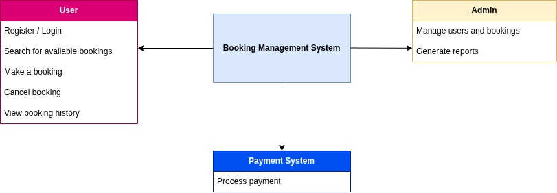

# Requirement Analysis in Software Development

## Introduction
This repository is created to demonstrate the concept of *Requirement Analysis* in software development. 

Requirement Analysis is the process of understanding, documenting, and managing the needs and expectations of users and stakeholders for a software system. It forms the foundation for designing, building, and validating software that meets real-world objectives.

The goal of this project is to explore the different stages, techniques, and best practices used in requirement analysis as part of the software development life cycle (SDLC).

## Why is Requirement Analysis Important?

Requirement Analysis plays a vital role in the Software Development Life Cycle (SDLC) because it sets the foundation for successful project delivery. Here are some key reasons why it is important:

1. **Clarity and Understanding**
   - It ensures that developers, designers, and stakeholders share a clear understanding of what the system should do.  
   - This reduces confusion and prevents costly misunderstandings later in the project.

2. **Better Project Planning**
   - With well-defined requirements, project managers can create accurate timelines, allocate resources effectively, and estimate costs with confidence.  
   - This leads to smoother execution and fewer unexpected issues during development.

3. **Minimizes Rework and Costs**
   - Identifying requirements early helps detect potential issues before coding begins.  
   - Fixing problems during the requirement phase is far cheaper than fixing them after deployment.

4. **Improves Quality**
   - Clear and complete requirements ensure the final product meets user expectations, resulting in higher satisfaction and better performance.

5. **Supports Validation and Testing**
   - Testers rely on well-documented requirements to design test cases and verify that the software meets all specified needs.

## Key Activities in Requirement Analysis

Requirement Analysis involves several structured activities that help ensure a clear understanding of user and system needs. Below are the five key activities:

- **1. Requirement Gathering**
  - This involves collecting information from stakeholders, users, and customers to understand what they need from the system.  
  - Techniques such as interviews, surveys, and brainstorming sessions are often used.

- **2. Requirement Elicitation**
  - Elicitation focuses on extracting detailed requirements through interactive communication with stakeholders.  
  - It goes beyond gathering by exploring *why* certain features or behaviors are needed.

- **3. Requirement Documentation**
  - All gathered and elicited requirements are documented in a structured format, usually in a Software Requirement Specification (SRS) document.  
  - This serves as a reference point for designers, developers, and testers throughout the project.

- **4. Requirement Analysis and Modeling**
  - In this phase, the documented requirements are analyzed for clarity, completeness, consistency, and feasibility.  
  - Models such as use case diagrams, data flow diagrams (DFD), and entity-relationship diagrams (ERD) are often used to visualize requirements.

- **5. Requirement Validation**
  - This step ensures that all documented requirements truly reflect what stakeholders need and are technically achievable.  
  - Validation helps detect errors or gaps early before development begins.

## Types of Requirements

In software development, requirements are generally divided into two main categories: **Functional** and **Non-functional** requirements. Both are essential for building a complete and reliable system.

### 1. Functional Requirements

**Definition:**  
Functional requirements describe what the system should do — the specific features, behaviors, and functions it must perform to meet user needs.

**Examples for the Booking Management Project:**
- The system should allow users to create an account and log in securely.
- Users should be able to search for available rooms, events, or slots by date and location.
- The system should allow users to make, update, or cancel bookings.
- The system should send booking confirmations and reminders via email or SMS.
- Administrators should be able to manage available rooms, view all bookings, and generate reports.

### 2. Non-functional Requirements

**Definition:**  
Non-functional requirements describe how the system should perform. They define the quality attributes such as speed, security, usability, reliability, and scalability.

**Examples for the Booking Management Project:**
- The system should load the booking page in under **3 seconds** under normal network conditions.
- The platform should be available **99.9% of the time** (high reliability).
- User data must be **encrypted** both in transit and at rest.
- The interface should be **mobile responsive** and accessible on all major browsers.
- The system should support up to **10,000 concurrent users** without performance degradation.

## Use Case Diagrams

### What are Use Case Diagrams?

A **Use Case Diagram** is a visual tool in software engineering used to represent how users (actors) interact with a system. It helps identify the system’s main functions (use cases) and the relationships between users and those functions.

### Benefits of Use Case Diagrams
- They provide a **clear visual summary** of the system’s functionalities.
- Help **identify system boundaries** and main user interactions.
- Facilitate **communication between developers, analysts, and stakeholders**.
- Serve as a **foundation for writing detailed functional requirements** and test cases.

---

### Example: Booking Management System Use Case Diagram
Below is an example use case diagram for a booking management system. It shows the main actors (User, Admin, and Payment System) and the primary use cases they interact with.

